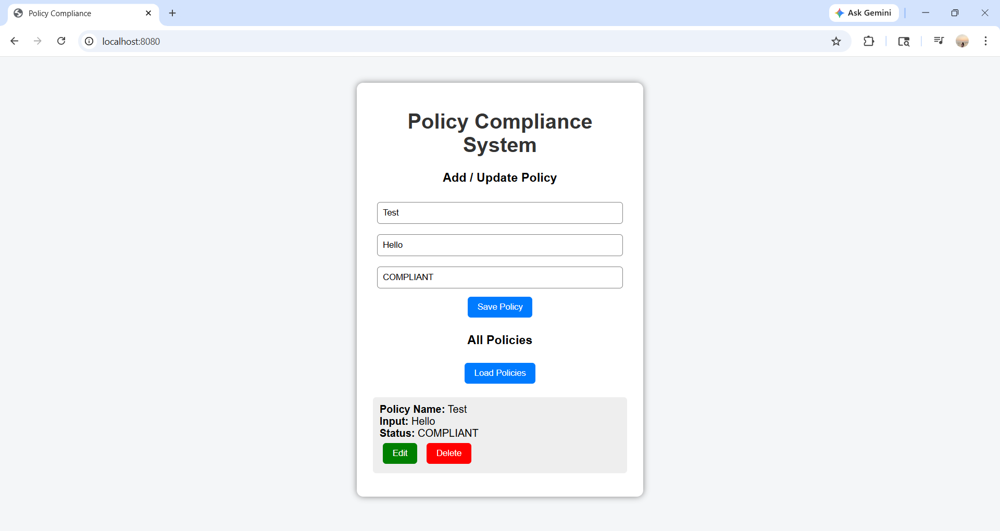
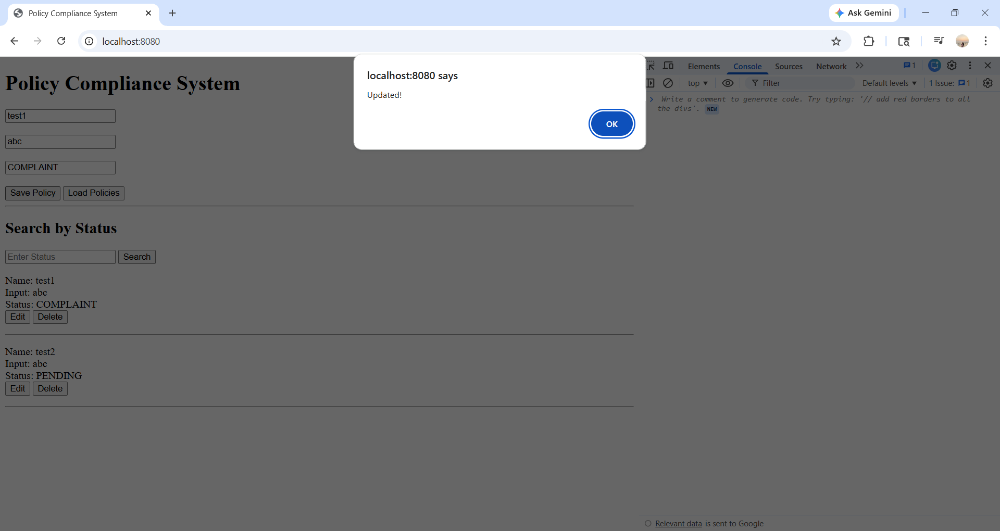
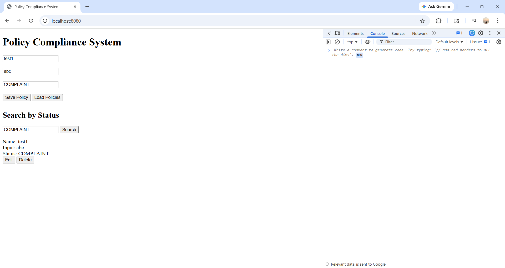

# Policy Compliance Testing System

## Overview
The Policy Compliance Testing System is a full-stack application designed to manage and validate policy data efficiently.

It allows users to:
- Add new policies
- View all stored policies
- Update existing policies
- Delete policies

The system ensures proper validation and smooth interaction between frontend and backend.

## System Architecture
- **Frontend** → HTML, CSS, JavaScript
- **Backend** → Spring Boot (Java)
- **Database** → MySQL
- **Build Tool** → Maven

## Features Implemented

###  Day 1 – Project Setup
- Spring Boot project initialized
- Basic structure configured

###  Day 2 – Database Integration
- MySQL database connected
- Table created using `V1_init.sql`

###  Day 3 – Backend Development
- REST APIs created
  - POST → Add policy
  - GET → Fetch policies

###  Day 4 – Frontend Development
- UI created using HTML & CSS
- Policy input form implemented

###  Day 5 – Integration
- Connected frontend with backend APIs
- Tested APIs using Postman
- Data stored and retrieved successfully

###  Day 6 – Enhancements
- Form validation added (All fields required)
- Edit functionality implemented
- Delete functionality implemented
- search by status implemented
- UI improvements for better user experience

### Day 7 - Enhancements

- Implemented Update (Edit) functionality
- Completed full CRUD operations (Create, Read, Update, Delete)
- Added Search by Status feature
- Improved UI using dropdown for status selection
- Form validation added (all fields required)
- Automatic form reset after saving/updating

### Day 7 - Enhancements

- Implemented Update (Edit) functionality
- Completed full CRUD operations (Create, Read, Update, Delete)
- Added Search by Status feature
- Improved UI using dropdown for status selection
- Form validation added (all fields required)
- Automatic form reset after saving/updating


## Screenshot

### Day 6 UI Output

<<<<<<< HEAD
### Day 7 UI Output
-
-
=======
.png)
.png>)

### Day 7 UI Output



>>>>>>> 5c77321 (fixed all images)

###  Backend
```bash
mvn spring-boot:run
