# Policy Compliance Testing System

## Overview
The Policy Compliance Testing System is a full-stack application designed to manage and validate policy data efficiently.

It allows users to:
- Add new policies
- View all stored policies
- Update existing policies
- Delete policies

The system ensures proper validation and smooth interaction between frontend and backend.

## System Architecture
- **Frontend** → HTML, CSS, JavaScript
- **Backend** → Spring Boot (Java)
- **Database** → MySQL
- **Build Tool** → Maven

## Features Implemented + screenshots

###  Day 1 – Project Setup
- Spring Boot project initialized
- Basic structure configured

###  Day 2 – Database Integration
- MySQL database connected
- Table created using `V1_init.sql`

###  Day 3 – Backend Development
- REST APIs created
  - POST → Add policy
  - GET → Fetch policies

###  Day 4 – Frontend Development
- UI created using HTML & CSS
- Policy input form implemented

###  Day 5 – Integration
- Connected frontend with backend APIs
- Tested APIs using Postman
- Data stored and retrieved successfully

###  Day 6 – Enhancements
- Form validation added (All fields required)
- Edit functionality implemented
- Delete functionality implemented
- search by status implemented
- UI improvements for better user experience

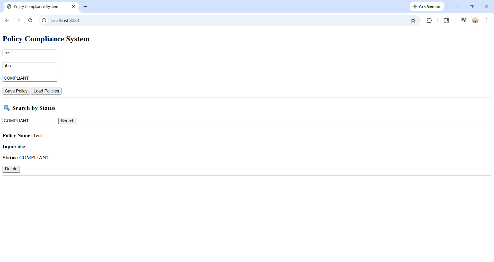

### Day 7

- Implemented Update (Edit) functionality
- Completed full CRUD operations (Create, Read, Update, Delete)
- Added Search by Status feature
- Improved UI using dropdown for status selection
- Form validation added (all fields required)
- Automatic form reset after saving/updatings

##  Day 8 - Enhancements

- Successfully implemented Edit and Delete functionality
- Displayed all policies dynamically on UI
- Added total policies count display
- Improved UI layout for better readability
- Fixed loading issue after saving policy
- Integrated frontend with backend APIs properly
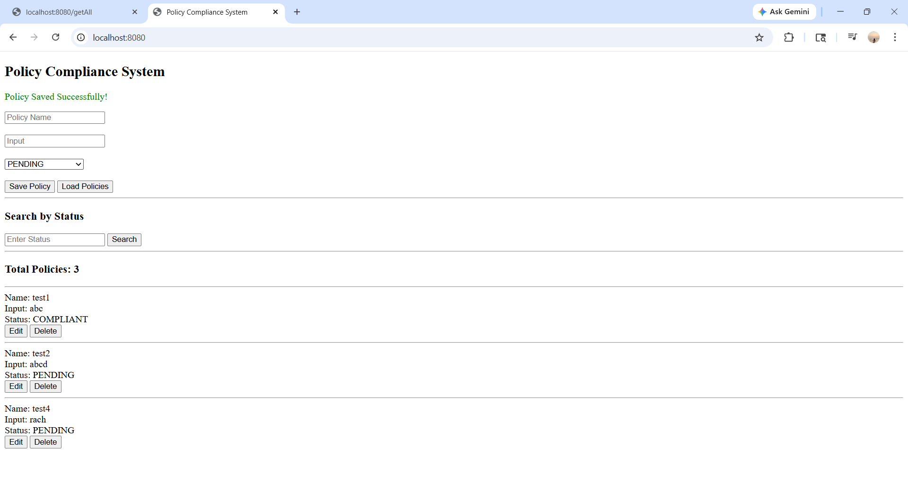

## Day 9 - Enhancements

- Implemented Search by Status functionality (COMPLIANT, NON_COMPLIANT, PENDING)
- Fixed button size issue (removed full-width buttons)
- Improved UI design for better alignment and spacing
- Displayed status using colored badges (Green, Red, Orange)
- Ensured proper integration of frontend with backend search API
- Verified complete CRUD operations (Save, Load, Search, Delete)
- Cleaned up layout for better user experience
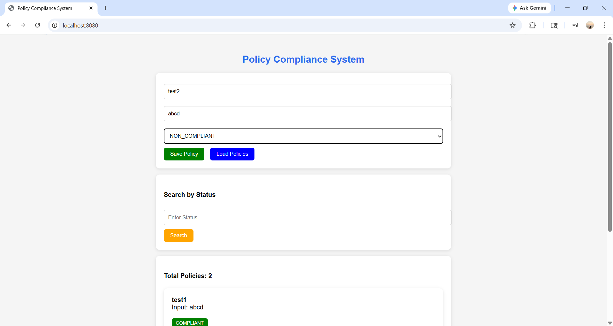
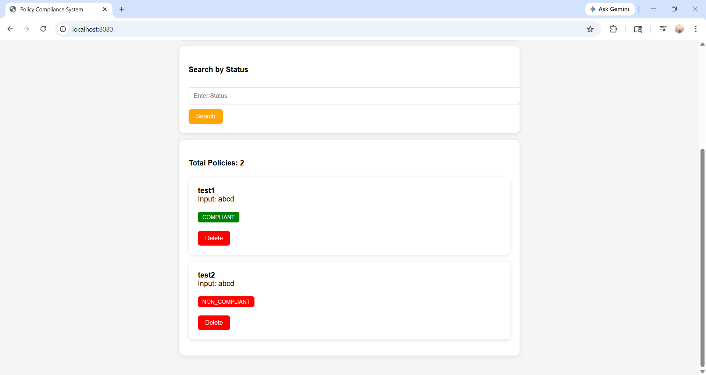

## Day 10 - Enhancements

- Implemented Edit functionality for updating existing policies  
- Allowed users to modify policy name, input, and status  
- Integrated PUT API for updating data in backend  
- Fixed duplicate entry issue while editing  
- Improved UI for Edit and Delete buttons  
- Ensured smooth working of all CRUD operations (Save, Load, Search, Update, Delete)  
- Tested complete frontend and backend integration
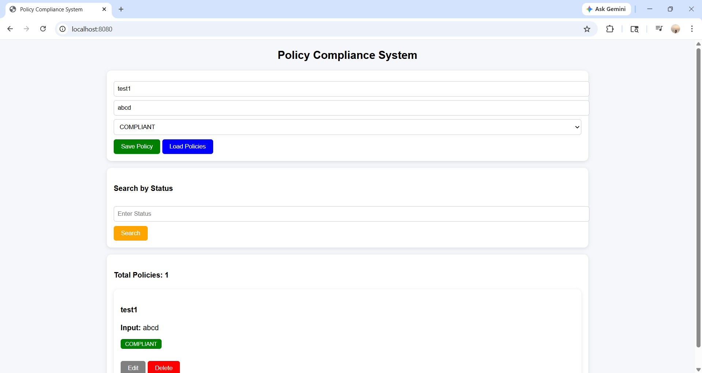

## Day 11 - Enhancements

- Added input validation to prevent empty fields before saving policy
- Implemented alert messages for Save, Update and Delete operations
- Added confirmation popup before deleting a policy
- Implemented automatic form reset after saving/updating
- Improved UI for better user experience and alignment
- Replaced search input with dropdown for better usability
- Tested all CRUD operations (Save, Load, Edit, Delete, Search)
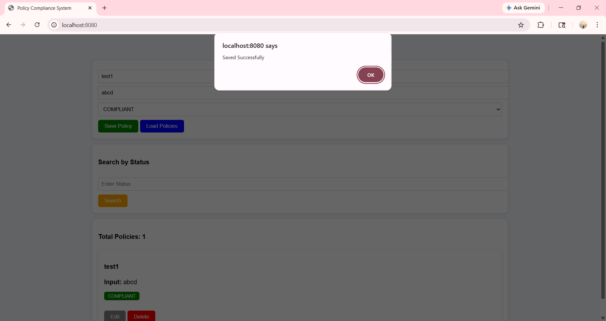
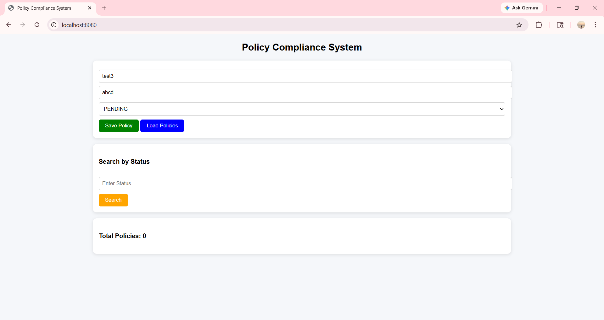
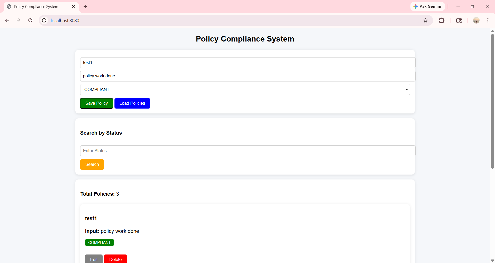
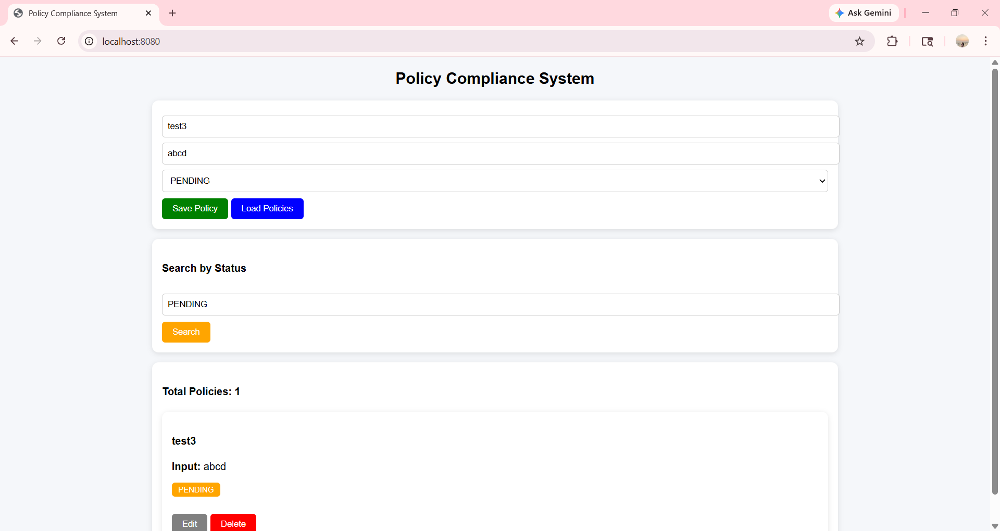

## Day 12 - Enhancements

- Added loading messages while fetching and searching data
- Implemented "No policies found" handling for empty results
- Added error handling for server failures
- Implemented Reset button to clear input fields
- Improved UI with better spacing, alignment and hover effects
- Added button loading state (disable + "Saving..." text)
- Displayed timestamp for each policy entry (extra feature)
- Enhanced overall user experience
- Verified all functionalities working correctly
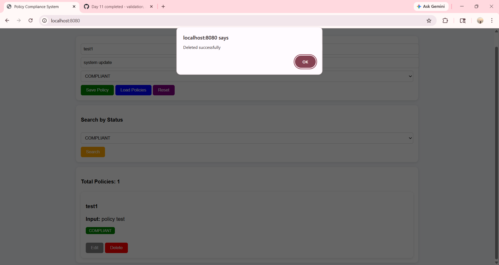
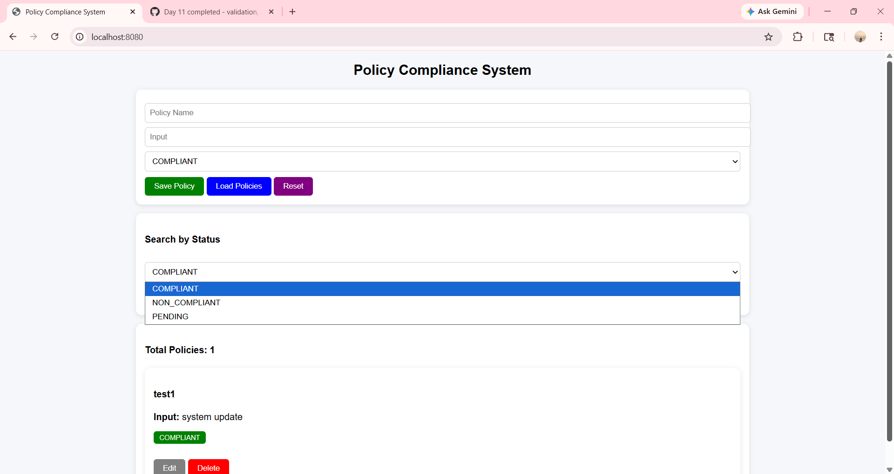
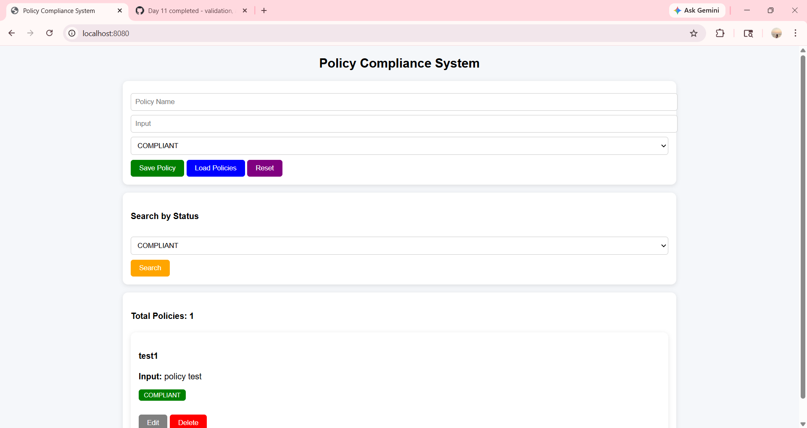

### Day 13 – UI Enhancement & Final Testing

#### Work Done:
- Improved UI with soft gradient background (light pink & blue)
- Enhanced heading with bold and darker styling
- Added smooth button hover effects
- Improved card layout with better spacing and shadow
- Ensured clean and professional user interface

#### Functional Enhancements:
- All CRUD operations tested successfully (Save, Load, Edit, Delete, Search)
- Proper validation for empty input fields
- Alert messages for user actions (Save, Update, Delete)
- Confirmation popup before deleting policy
- Auto reset form after operations
- Search functionality working with dropdown
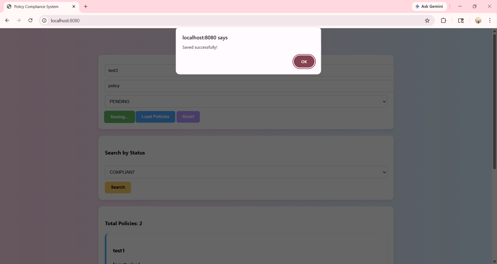  
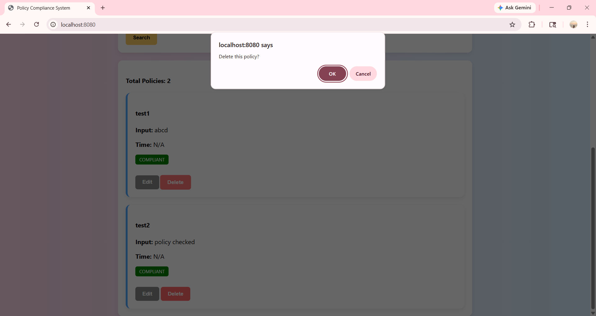   
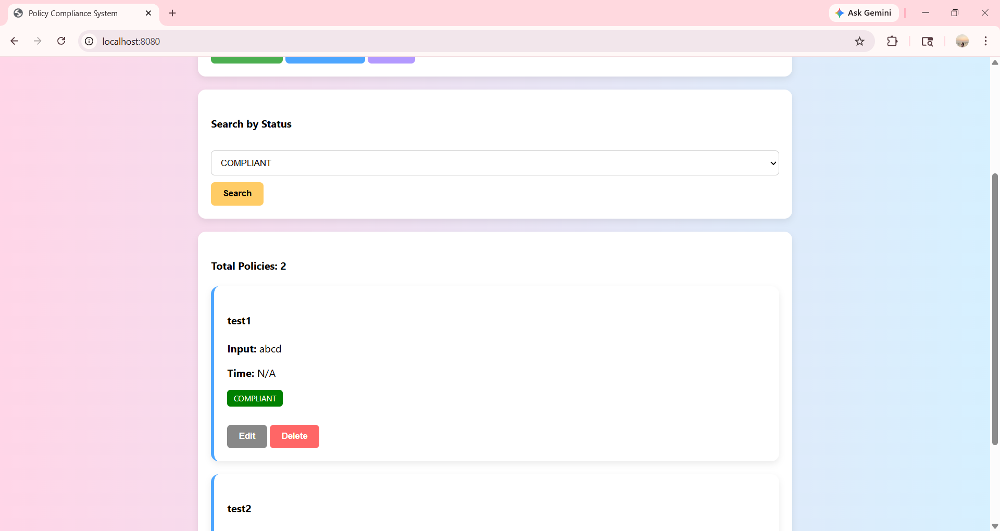

### Day 14 – Dashboard Enhancement & Statistics Module

#### Functional Enhancements:
- Added dashboard statistics cards for better visualization
- Displayed total compliant policies count
- Displayed total non-compliant policies count
- Displayed total pending policies count
- Improved UI design with gradient background and colorful cards
- Enhanced overall user experience and layout
- Added hover effects and responsive dashboard section
- Tested all CRUD operations successfully
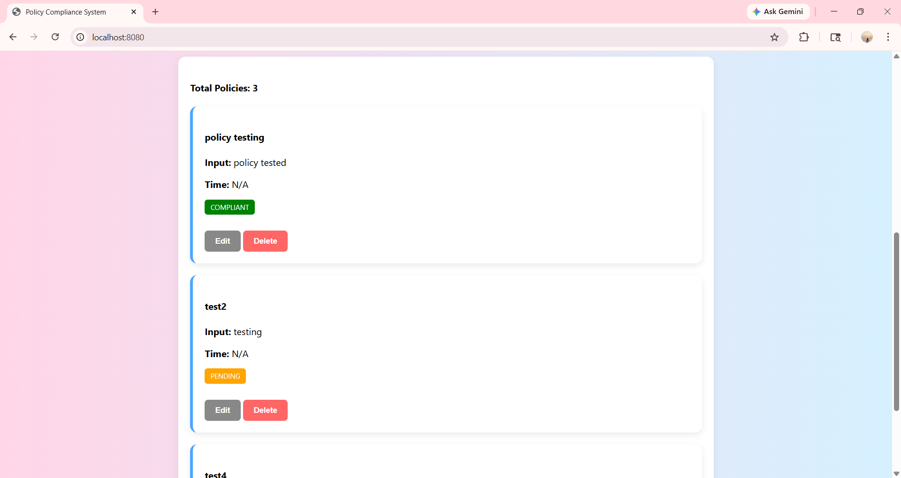
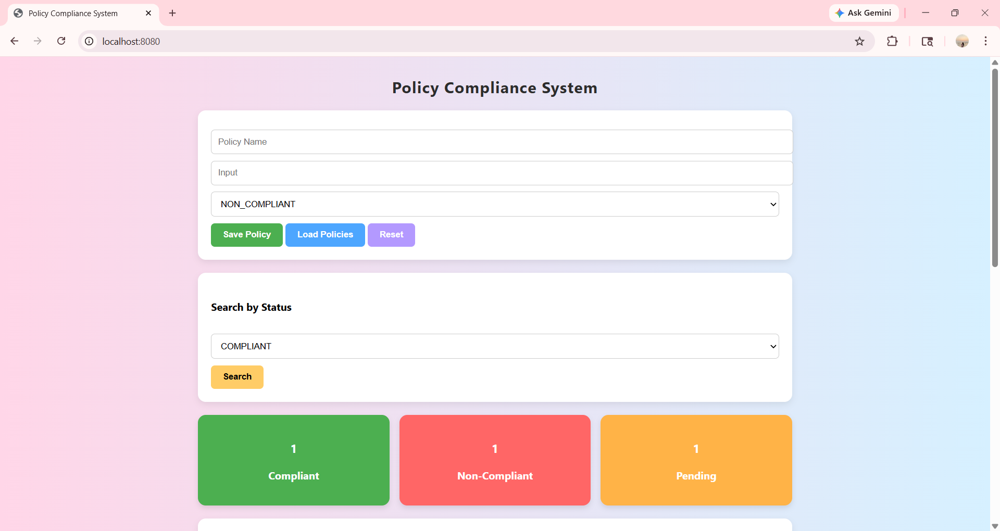

#### Status:
All features are working correctly and tested successfully.